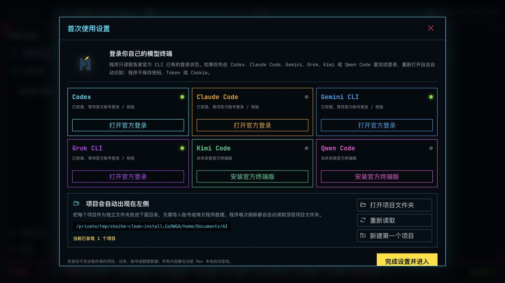
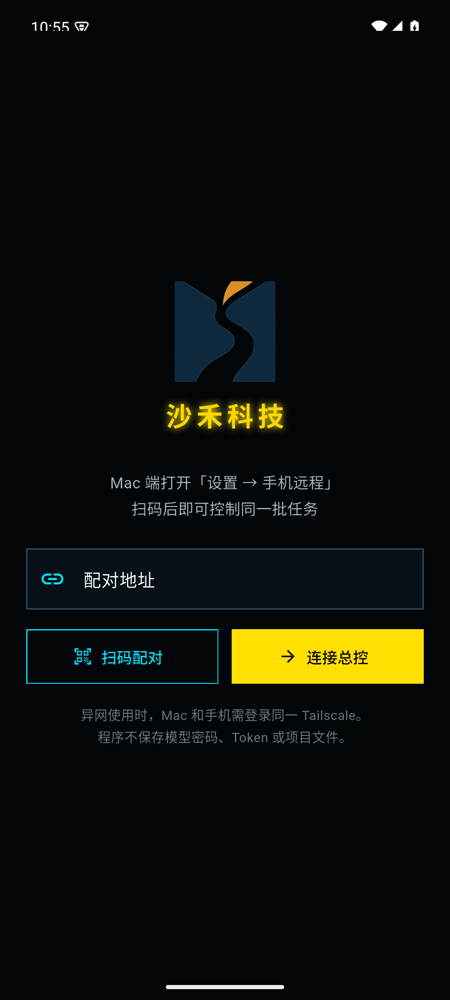
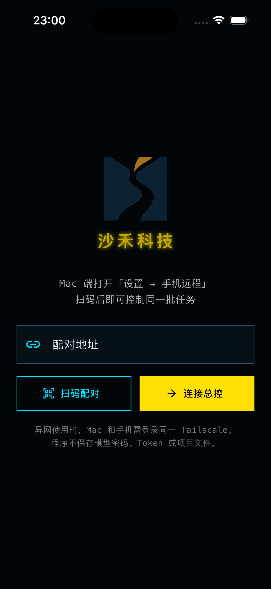

# 沙禾项目终端

沙禾项目终端是一套面向多模型官方 CLI 的项目与真实终端工作驾驶舱。macOS 负责在本机统一管理项目、任务、账号状态、模型、额度与 tmux 会话；Windows、Android 和 iPhone 作为遥控端，通过局域网或 Tailscale 连接 Mac 工作端。

> 当前公开版本：**4.4.1**  
> [下载各平台安装包](https://github.com/olikahn11/shaihe-ai-project-terminal-public/releases/latest) · [安装说明](INSTALL.md) · [SHA-256 校验值](SHA256SUMS.txt)

## 主要功能

- 在同一界面管理 Codex、Claude Code、Gemini CLI、Grok CLI、Kimi Code 与 Qwen Code。
- 项目、对话和 Markdown 任务清单同源展示，可新建、继续、接力和查看真实进度。
- 任务由真实 tmux/PTY 托管，关闭窗口或遥控端断线不会结束后台任务。
- 支持 1–6 个真实终端平铺，并可分别切换账号、模型终端、具体模型和推理强度。
- 账号登录、退出与换号交给各家官方 CLI；应用只显示能够复核的状态，不建立凭据仓库。
- 手机与 Windows 可扫码或输入配对地址，异网场景可通过 Tailscale 端到端连接。
- 项目统一读取当前用户的 `~/Documents/AI`，发行包不包含开发者的项目、账号、额度或会话数据。

## 平台说明

| 平台 | 形态 | 说明 |
| --- | --- | --- |
| macOS | 完整工作端 | 在本机运行官方模型 CLI、项目扫描、任务终端和远程服务 |
| Windows | 遥控端 | 连接正在运行的 Mac 工作端，不在 Windows 本地运行 macOS CLI |
| Android | 遥控端 | 扫码或输入地址连接 Mac 工作端 |
| iPhone | 遥控端 / Web App | 当前 IPA 未签名；无证书时可直接使用响应式 Web App |

## 界面预览

### macOS 首次设置

### Android 与 iPhone 配对

  
  

## 隐私与凭据

沙禾项目终端不随安装包分发任何用户项目、账号数据、Token、Cookie 或模型密钥。模型登录与授权由对应官方 CLI 完成；Gemini API Key 等本机凭据由系统安全存储管理，不进入项目文件或公开仓库。

## 发行状态

4.4.1 是可安装测试发行版：macOS 使用 ad-hoc 签名且尚未公证，Windows 尚无 Authenticode，Android 使用开发测试证书，iOS IPA 未签名。首次安装可能出现系统安全提示，详情见 [安装说明](INSTALL.md)。

## 版权

本仓库只包含软件介绍、截图、安装说明和公开发行附件，不包含源代码。未附开源许可证，保留所有权利。
